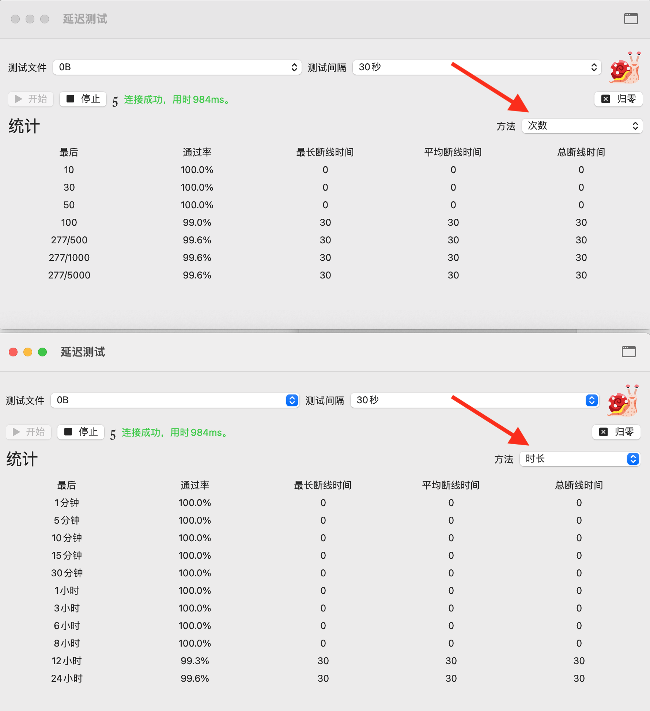
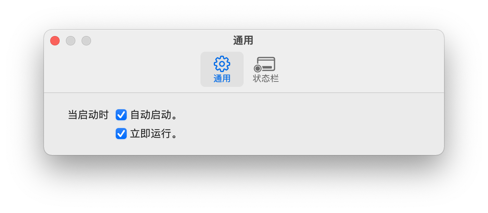
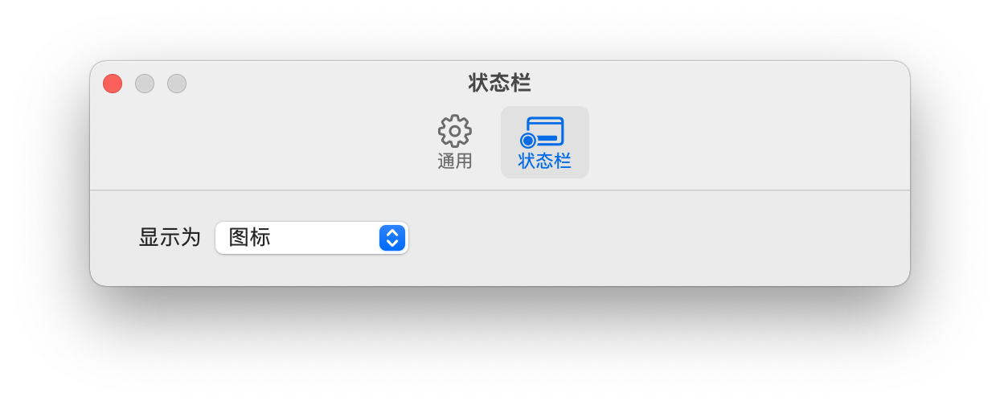
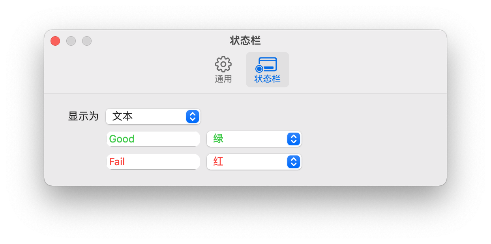
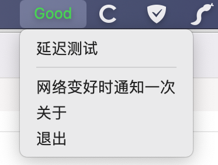

# 延迟测试
延迟测试，顾名思义，是一个用来测试网络延迟的工具。特别的，它用来检测你的网络是否被墙。

## 原理
延迟测试会尝试下载某一个指定的文件，默认情况下会是一个空文件，位于github。然后计算下载过程用掉了多少时间。

> 你可以在源代码中，更改地址，改成你自己想要测试的文件。因为有些人的网络中，github可能是不被屏蔽的。

## 主界面
### 统计
统计方法两种，次数和时长。

#### 次数
最近N次测试的结果。

> 需要注意的是，虽然测试是相连的。但是测试次数之间的时间间隔不一定是连续的，这是因为有可能你这次测试是在电脑睡眠之后进行的。那样就会距离上次测试很久。此时，可以点击归零，清空测试结果。
#### 时长
最近一段时间内测试的结果。

> 需要注意的是。如果之前电脑处于睡眠状态，那么是没有测试记录的。此时，可以点击归零，清空测试结果。

> 可以通过文件菜单新建多个窗口，同时监控次数和时长。

### 窗口在最前
右上角可以将当前窗口置于最前。

## 设置
### 通用

#### 自动启动
开启此项，应用会随着系统用户登录自动启动。
#### 立即执行
开启此项，应用会在启动后自动开始运行。
### 状态栏
#### 图标

当网络通时，状态栏显示为单色图标。当网络不通时，状态栏显示为彩色图标。

#### 文本

当网络通时，默认显示绿色的“Good”。当网络不通时，默认显示红色的“Fail”。文字和颜色都可以更改。
## 菜单栏

### 延迟测试
显示主程序
### 网络变好时通知一次
当此菜单被选中时，如果下一次的测试，网络通了，就会进行通知。通知后自动取消菜单的选中状态。如果网络不通，则菜单仍旧被选中。这样可以在网络通后，进行通知。并且不会有多余的干扰。

## Icons
下面是延迟测试中用到的图标。

Icons made by <a href="https://www.flaticon.com/authors/rabbixcons" title="Rabbixcons">Rabbixcons</a> from <a href="https://www.flaticon.com/" title="Flaticon">www.flaticon.com</a>

Icons made by <a href="https://www.flaticon.com/authors/vitaly-gorbachev" title="Vitaly Gorbachev">Vitaly Gorbachev</a> from <a href="https://www.flaticon.com/" title="Flaticon">www.flaticon.com</a>

